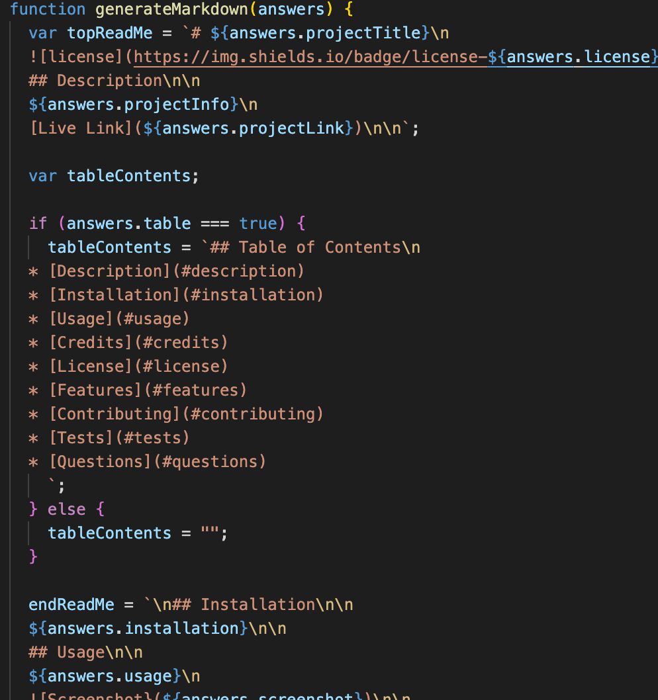

# Create Read Me File

## Description

Creates unique Read Me files quickly.

[Video Link](https://drive.google.com/file/d/1uSLRtKF4DGA3raXzcSO9ECwNMGzPI3fu/view)

## Table of Contents

- [Description](#description)
- [Installation](#installation)
- [Usage](#usage)
- [License](#license)
- [Features](#features)
- [Tests](#tests)
- [Questions](#questions)

## Installation

You will need to install the iquirer package.

- Uses the [Inquirer package](https://www.npmjs.com/package/inquirer).

You will also need to install the node modules found with npm init.

## Usage

Using your terminal to answer questions will creates a dynamic Read Me file. This is helpful for any developer who wants to streamline their production. This was very interesting to program and offered great challenges to think through. My favorite challenge was how to create a table of contents if and only if the user wanted one. Below you can see how I made that option appear or not in the Read Me file.

Git Hub

# [JessGiannini](https://github.com/JessGiannini)

## License

MIT

## Features

This application has all the functionality of a standard Read Me file including a table of contents if you want it. This feature is optional.

## Tests

No tests at this time.

## Questions

If you have any questions you can email me at undefined or find me on Git Hub.

# [JessGiannini](https://github.com/JessGiannini)
